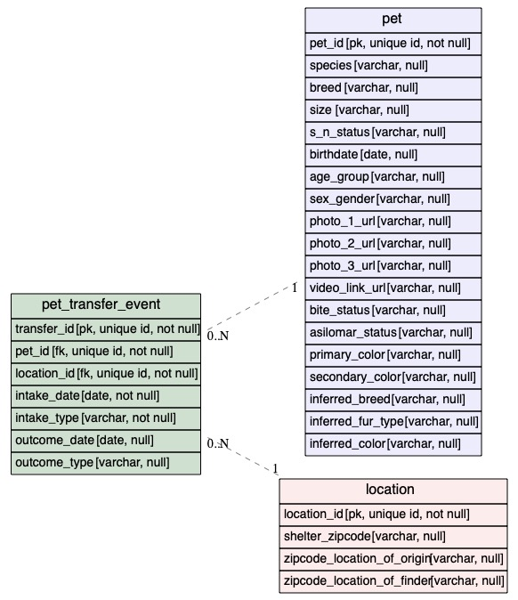

# Save All the Pets Entity Relationship Diagram

(Alex) - Hey everyone! This is my first pass at putting together a simple ERD for the data.  I plan on doing some additional data cleaning on the data such as appropriate data types and also putting together some data profiling such as statistics, percent null, etc.

I am using a tool [BurntSushi/erd](https://github.com/BurntSushi/erd) for rendering the document and a VS Code extension [ER Syntax Highlighitng](https://marketplace.visualstudio.com/items?itemName=mikkel-ol.er-syntax-highlighting) for syntax highlighting for the *.er files.

